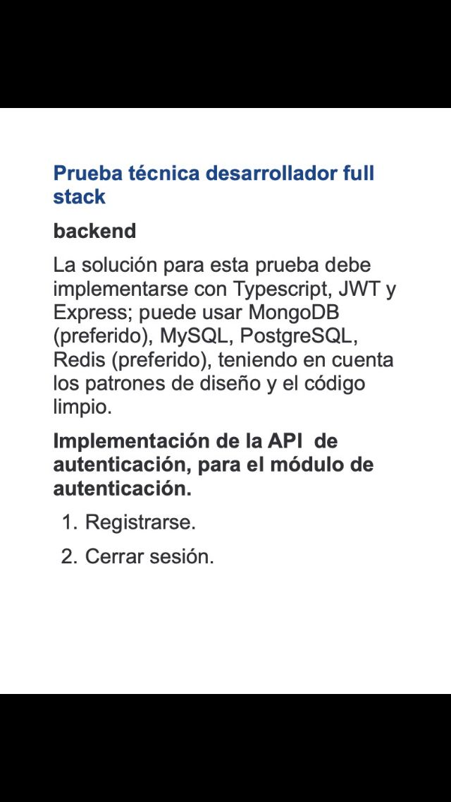

# Requisitos de Prueba
{width='200px'}


# Aclaraciones
No use varables de entorno para que les resulte mas facil desplegar la aplicacion


# Instalación 🔧

El Backend fue realizado con Express, TypeScript, Typegoose(ODM), JTW y MongoDB desplegado en Mongo Atlas

## Backend paso a paso ⌨️

_Instalamos los paquetes de Node_

```
npm install
```

_Y ejecutamos con_

```
npm run dev
```

_El Backend se componen por 2 rutas principales, una dedicada a la Autorizacion_

```
http://localhost:4000/api/auth
```

_y la otra al CRUD de Usuarios_
```
http://localhost:4000/api/user
```

## Frontnd ⚙️ paso a paso

El Front esta realizado con React.js y React Redux, las rutas con React-Router-Dom 
y los estilos con Material UI


```
http://127.0.0.1:5173/
```

_Antes de arracar el proyecto_

```
npm install
```

_Para iniciarlo_

```
npm run dev
```

El Front posee tres rutas 

_Home_

Donde vas a dirigirnos una vez hecho la autenticacion
```
/
```

_Registro_

Ruta para regitrarse
```
/register
```

_Login_

Ruta para logearse
```
/login
```


## Autores ✒️
_Santiago Segurado_
